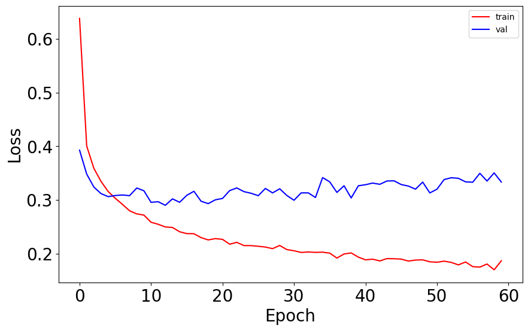

<a id="readme-top"></a>

<h1 align="center">Neural Network Classification Projects</h1>

<p align="center">
  Two classification projects using artificial neural networks: handwritten digit recognition (MNIST) and butterfly image classification.
</p>

<p align="center">
  
  
  
  
</p>
<br>

## Table of Contents

1. [Overview](#overview)  
2. [Key Features](#key-features)  
3. [Getting Started](#getting-started)  
4. [Usage](#usage)  
5. [Technical Details](#technical-details)  
6. [Midterm Project](#midterm-project)  
7. [Final Project](#final-project)  
8. [Evaluation & Results](#evaluation--results)
9. [License](#license) 

<br>

## Overview

This repository includes two Artificial Neural Network (ANN) projects developed as part of coursework: a midterm project and a final project.

The main objective of these projects is to design, train, and evaluate neural network models for supervised learning tasks while building a strong understanding of the full machine learning workflow.

These projects focus on:

- Data preprocessing and feature preparation  
- Neural network architecture design  
- Model training and optimization  
- Performance evaluation  
- Result interpretation and comparison  

Together, the notebooks demonstrate both theoretical understanding and practical implementation of ANN-based modeling.

<br>
<p align="right">(<a href="#readme-top">back to top</a>)</p>
<br>

## Key Features

| Feature | Description |
|--------|------------|
| ANN Modeling | Fully connected neural networks for supervised learning tasks |
| Data Preprocessing | Preparation, normalization, and organization of input data |
| Training Pipeline | End-to-end workflow from raw input to trained model |
| Performance Tracking | Monitoring training behavior through loss and/or accuracy |
| Visualization | Graph-based analysis of data and model behavior |
| Comparative Analysis | Opportunity to compare midterm and final project approaches |
| Notebook-Based Workflow | Interactive implementation and experimentation in Jupyter |

<br>
<p align="right">(<a href="#readme-top">back to top</a>)</p>
<br>

## Getting Started

### Prerequisites

- Python 3.8+
- Jupyter Notebook
- pip

<br>

### Install the required libraries:

```bash
pip install numpy pandas matplotlib scikit-learn
```

### Run Jupyter Notebook:

```bash
jupyter notebook
```

### Then open and run:

- `annmidterm.ipynb`
- `annfinal.ipynb`

<br>
<p align="right">(<a href="#readme-top">back to top</a>)</p>
<br>

## Usage

1. Open the related notebook  
2. Run the cells in order  
3. Observe preprocessing and model-building steps  
4. Follow the training process  
5. Review evaluation outputs and results  

This structure makes it easy to understand how the models were developed and how performance was analyzed in each project.

<br>
<p align="right">(<a href="#readme-top">back to top</a>)</p>
<br>

## Technical Details

### Libraries Used

- numpy → numerical computations  
- pandas → data manipulation  
- matplotlib → visualizations  
- scikit-learn → preprocessing and supporting machine learning utilities

<br>

### Core ANN Concepts Applied

- Input, hidden, and output layers  
- Forward propagation  
- Loss computation  
- Backpropagation  
- Gradient-based weight updates  
- Model evaluation and interpretation  

<br>
<p align="right">(<a href="#readme-top">back to top</a>)</p>
<br>

## Midterm Project

The midterm notebook focuses on the earlier stage of ANN implementation and model development.

This part of the repository is centered on building a foundational understanding of neural networks through:

- Preparing the dataset for model training  
- Constructing the ANN workflow step by step  
- Running training iterations  
- Observing how the model learns over time  
- Evaluating prediction performance  

The midterm project highlights the core mechanics of neural network training and provides a structured introduction to supervised ANN modeling.

<br>

### Midterm Dataset Distribution

<p align="center">
  
</p>

<p align="center">
  Distribution of butterfly classes used in the midterm project dataset.
</p>
<br>

### Midterm Sample Images

<p align="center">
  
</p>

<p align="center">
  Example butterfly images from several dataset classes used in the midterm project.
</p>
<br>

### Midterm Model Results (Sample Table)

Below is a small portion of the evaluation results:

| Sample | X1 | X2 | X3 | True X4 |
|--------|----|----|----|---------|
| 1 | 0.738 | 0.753 | 0.216 | 1.594 |
| 2 | 0.048 | 0.082 | 0.874 | 1.074 |
| 3 | 0.138 | 0.920 | 0.199 | 1.300 |
| 4 | 0.637 | 0.524 | 0.281 | 1.394 |
| 5 | 0.093 | 0.142 | 0.770 | 0.992 |

<br>

<p align="center">
  Additional sample output shown for better interpretation of model performance.
</p>

<br>
<p align="right">(<a href="#readme-top">back to top</a>)</p>
<br>

## Final Project

The final notebook extends the ANN workflow with a more developed and refined implementation.

This section focuses on:

- Applying neural network methods to a complete learning task  
- Improving the training and evaluation pipeline  
- Interpreting model behavior in greater detail  
- Comparing outcomes more carefully  
- Demonstrating stronger end-to-end project organization  

The final project reflects a more advanced stage of experimentation and analysis, showing how ANN concepts can be applied in a more complete and polished workflow.

<br>

### Final Project Visualizations

<p align="center">
  
</p>

<p align="center">
  Training loss trend across epochs in the final project.
</p>
<br>

<p align="center">
  
</p>

<p align="center">
  Training and validation accuracy across epochs in the final project.
</p>
<br>

### Final Model Results

<p align="center">
  
</p>

<p align="center">
  Training and validation loss comparison used to interpret model performance in the final project.
</p>

<br>
<p align="right">(<a href="#readme-top">back to top</a>)</p>
<br>

## Evaluation & Results

Model performance across the notebooks is evaluated using outputs such as:

- Accuracy  
- Loss values  
- Prediction comparisons  
- Training visualizations  

<br>

These results help analyze:

- Learning behavior during training  
- Strengths and weaknesses of the models  
- Generalization performance  
- Differences between the midterm and final project implementations  

The visual and numerical outputs in both notebooks provide a clear view of how the models improve and how their performance can be interpreted.

<br>
<p align="right">(<a href="#readme-top">back to top</a>)</p>
<br>

## License

This project is licensed under the MIT License.  
See the [LICENSE](LICENSE) file for details.

<p align="right">(<a href="#readme-top">back to top</a>)</p>
